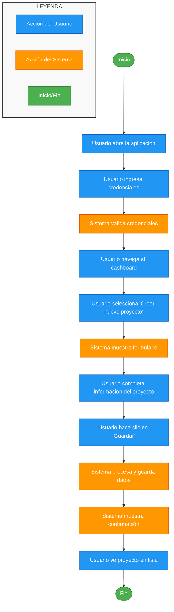

# Cine Flow

Este repositorio contiene todo el código para adminitrar salas de cine de manera digital.

## Definiendo User Flows

La aplicación esta dirigida a dos tipos de usurios:

- Los que comprar tickets para asistir la funciones (Cliente)
- Los que administran las funciones a ser presentadas (Administrador)

Como hay algunas tareas son comunes para **clientes** y **administradores** las vamos a definir bajo la etiqueta de **usuarios**.

### Usurios

#### Crear Usurio

#### Cambiar contraseña

### Administrador

#### Agregar Películas

#### Vincular películas con salas por día y hora

### Cliente

#### Consultar horarios de una película

#### Consultar todos disponibles de un día

#### Cambiar contraseña

#### Crear usuario

#### Comprar tickets para película

# Ejemplo de diagrama

https://templatemo.com/tm-559-zay-shop

