# Cine Flow

Sistema digital para administración de ventas de tickets para cines.

---

## 📋 Planificación

Antes de escribir código, definimos las capacidades que el usuario final debía tener. Utilizamos herramientas de UX y User Flow para diseñar cada vista (usuario, administrador, encargado de entrada), los cuales se encuentran en la carpeta de diagramas.

Con esta base, creamos el diagrama de Entidad-Relación que define la estructura de la base de datos.

### Creación de User Flow


### Creación del Diagrama Entidad-Relación


---

## 🔧 Entorno de Desarrollo

Para garantizar un entorno reproducible independientemente del sistema operativo, utilizamos contenedores Docker accesibles por SSH (puerto 2224) o mediante interfaces de desarrollo.

Definimos un entorno estable y reproducible mediante `default.nix`, que incluye todas las herramientas necesarias:

- **Flask y extensiones:** `flask`, `flask-login`, `flask-bcrypt`
- **Base de datos:** `sqlalchemy`, `pymssql`, `freetds`
- **Reportes:** `pandas`, `openpyxl`, `reportlab`

```bash
cat ./default.nix
let
  pkgs = import (fetchTarball "https://github.com/rstats-on-nix/nixpkgs/archive/2025-12-02.tar.gz") {};

  pyconf = builtins.attrValues {
    inherit (pkgs.python313Packages)
      pip
      ipykernel
      flask
      flask-login
      flask-bcrypt
      sqlalchemy
      pymssql
      pandas
      openpyxl
      reportlab;
  };

  system_packages = builtins.attrValues {
    inherit (pkgs)
      glibcLocales
      nix
      python313
      freetds;
  };

  shell = pkgs.mkShell {
    LOCALE_ARCHIVE = if pkgs.system == "x86_64-linux" then "${pkgs.glibcLocales}/lib/locale/locale-archive" else "";
    LANG = "en_US.UTF-8";
    LC_ALL = "en_US.UTF-8";
    LC_TIME = "en_US.UTF-8";
    LC_MONETARY = "en_US.UTF-8";
    LC_PAPER = "en_US.UTF-8";
    LC_MEASUREMENT = "en_US.UTF-8";
    buildInputs = [ pyconf system_packages ];
  };
in
  {
    inherit pkgs shell;
  }
```

---

## 🐳 Docker Compose

Este archivo facilita el despliegue completo de la aplicación:

1. **SQL Server** en contenedor Ubuntu
2. **Inicialización de la base de datos** con datos de prueba
3. **Ejecución de la aplicación Flask** en puerto 5000

```yaml
cat ./docker-compose.yml
services:
  # 1. SQL SERVER
  mssql2025:
    image: mcr.microsoft.com/mssql/server:2025-RC1-ubuntu-24.04
    container_name: mssql2025
    hostname: mssql2025
    environment:
      ACCEPT_EULA: "Y"
      MSSQL_SA_PASSWORD: "Pass123!"
    ports:
      - "1433:1433"
    networks:
      - dev-network
    volumes:
      - ./cineflow_setup.sql:/tmp/mssql-init.sql
    healthcheck:
      test: >
        /opt/mssql-tools18/bin/sqlcmd
        -S localhost
        -C
        -U sa
        -P Pass123!
        -Q "SELECT 1"
        -b -o /dev/null
      interval: 1s
      timeout: 30s
      retries: 30
      start_period: 20s

  # 2. INICIALIZACIÓN DE BASE DE DATOS
  mssql-init:
    image: mcr.microsoft.com/mssql-tools:latest
    container_name: mssql-init
    restart: "no"
    depends_on:
      mssql2025:
        condition: service_healthy
    networks:
      - dev-network
    volumes:
      - ./cineflow_setup.sql:/tmp/mssql-init.sql
    command: >
      /bin/sh -c "
        /opt/mssql-tools/bin/sqlcmd -S mssql2025 -U sa -P Pass123! -Q \"IF DB_ID('CineFlow') IS NULL CREATE DATABASE CineFlow\" &&
        until /opt/mssql-tools/bin/sqlcmd -S mssql2025 -U sa -P Pass123! -Q \"SELECT name FROM sys.databases WHERE name='CineFlow'\" | grep -q CineFlow;
        do echo 'Esperando que CineFlow esté disponible...'; sleep 2; done &&
        /opt/mssql-tools/bin/sqlcmd -S mssql2025 -U sa -P Pass123! -d CineFlow -i /tmp/mssql-init.sql
      "

  # 3. APLICACIÓN
  cineflow:
    build:
      context: .
    container_name: cineflow
    ports:
      - "2224:22"
      - "5000:5000"
    volumes:
      - .:/root/cineflow
    networks:
      - dev-network
    depends_on:
      - mssql-init

networks:
  dev-network:
    driver: bridge
```

---

## 🔐 Acceso SSH al Contenedor

Para desarrollo, debugging y mantenimiento, puedes acceder directamente al contenedor vía SSH:

```bash
ssh root@localhost -p 2224
```
**Contraseña:** `sbs`

### 🐚 Usando nix-shell dentro del contenedor

Una vez conectado al contenedor, navega al directorio del proyecto:

```bash
cd /root/cineflow
```

Activa el entorno de desarrollo completo con:

```bash
nix-shell
```

Esto cargará automáticamente:
- Python 3.13 con todas las dependencias
- SQL Server tools
- Variables de entorno configuradas

### 📁 Estructura dentro del contenedor

```
/root/cineflow/
├── app.py              # Punto de entrada principal
├── controllers/        # Controladores MVC
├── models.py          # Modelos SQLAlchemy
├── templates/         # Vistas HTML
├── cineflow_setup.sql # Script de BD
└── default.nix        # Configuración del entorno
```

### 🔧 Comandos útiles dentro del contenedor

```bash
# Activar entorno y ejecutar la aplicación
nix-shell --run "python app.py"

# Ejecutar scripts específicos
nix-shell --run "python crear_usuarios_hash.py"

# Abrir shell Python interactivo con entorno cargado
nix-shell --run "python"

# Verificar conexión a SQL Server
nix-shell --run "python -c 'from database import engine; print(engine)'"

# Probar consultas a la base de datos
nix-shell --run "python -c 'from models import Pelicula; from database import Session; session = Session(); print(session.query(Pelicula).all())'"
```

### 💡 ¿Por qué SSH + nix-shell?

1. **Desarrollo aislado**: Todo ocurre dentro del contenedor, sin afectar tu sistema local
2. **Entorno reproducible**: `nix-shell` garantiza las mismas versiones en cualquier máquina
3. **Debugging directo**: Puedes inspeccionar el estado real de la aplicación en ejecución
4. **Mantenimiento simplificado**: Facilita migraciones de BD, pruebas unitarias y debugging
5. **Integración con IDEs**: Puedes conectar VS Code u otros editores vía SSH para desarrollo remoto

---

## 🗂️ Estructura del Proyecto (MVC Estricto)

Seguimos estrictamente el patrón MVC. Los modelos no se usan directamente en `app.py`; en su lugar, creamos controladores especializados para manejar toda la lógica, facilitando el mantenimiento a largo plazo.

```
.
├── app.py
├── cineflow_setup.sql
├── config.py
├── controllers/
│   ├── asiento_controller.py
│   ├── boleto_admin_controller.py
│   ├── boleto_cancelado_controller.py
│   ├── boleto_controller.py
│   ├── boleto_usado_controller.py
│   ├── cine_controller.py
│   ├── clasificacion_controller.py
│   ├── dashboard_controller.py
│   ├── funcion_admin_controller.py
│   ├── funcion_controller.py
│   ├── genero_controller.py
│   ├── idioma_controller.py
│   ├── pelicula_admin_controller.py
│   ├── pelicula_controller.py
│   ├── pelicula_genero_controller.py
│   ├── rol_controller.py
│   ├── sala_controller.py
│   ├── tipo_boleto_controller.py
│   ├── tipo_sala_controller.py
│   ├── usuario_admin_controller.py
│   └── usuario_controller.py
├── crear_usuarios_hash.py
├── crear_usuarios_hash.sql
├── database.py
├── default.nix
├── diagramas/
├── docker-compose.yml
├── Dockerfile
├── entrypoint.sh
├── img/
├── models.py
├── static/
├── templates/
└── README.md
```

---

## 🚀 Despliegue de la Aplicación

Si ya tienes Docker instalado, solo ejecuta:

```bash
docker compose up -d --build
```

La aplicación estará disponible en:  
**http://localhost:5000**

Para detenerla y eliminar los contenedores (incluyendo los datos temporales de la BD):

```bash
docker compose down
```

---

## 🖼️ Imágenes del Proyecto

### 👤 Vista del Usuario
  
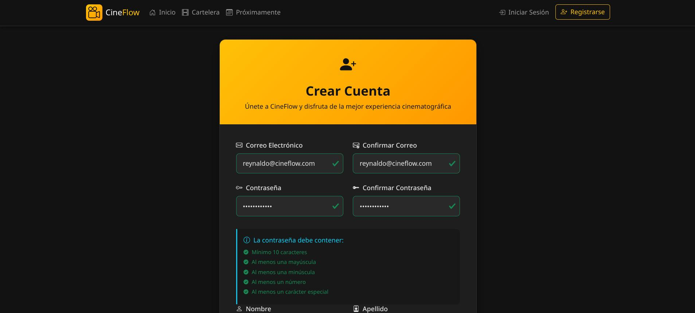  
  
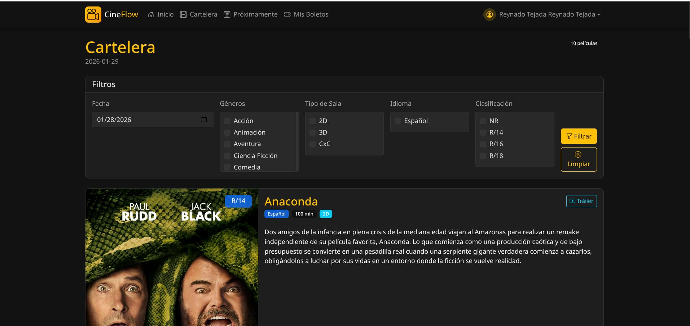  
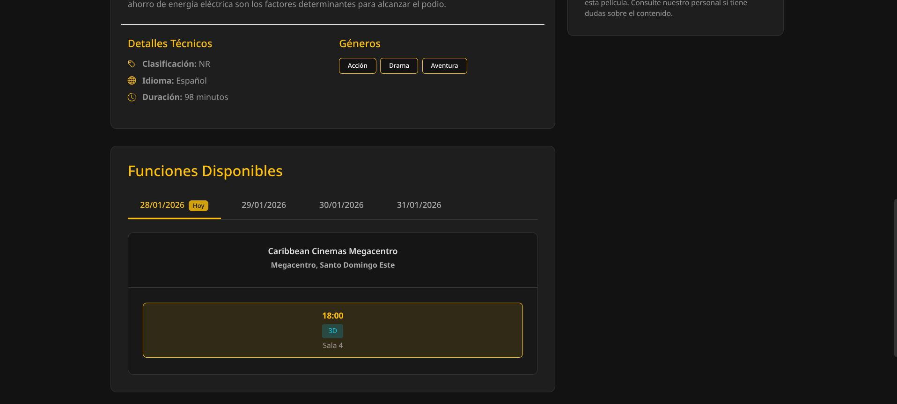  
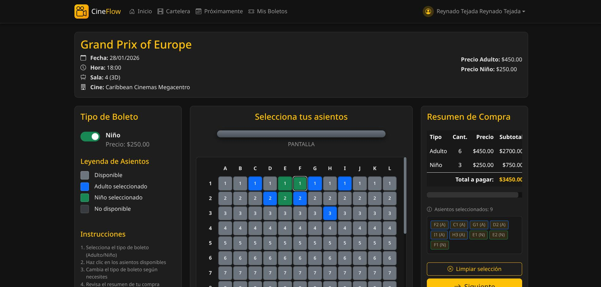  
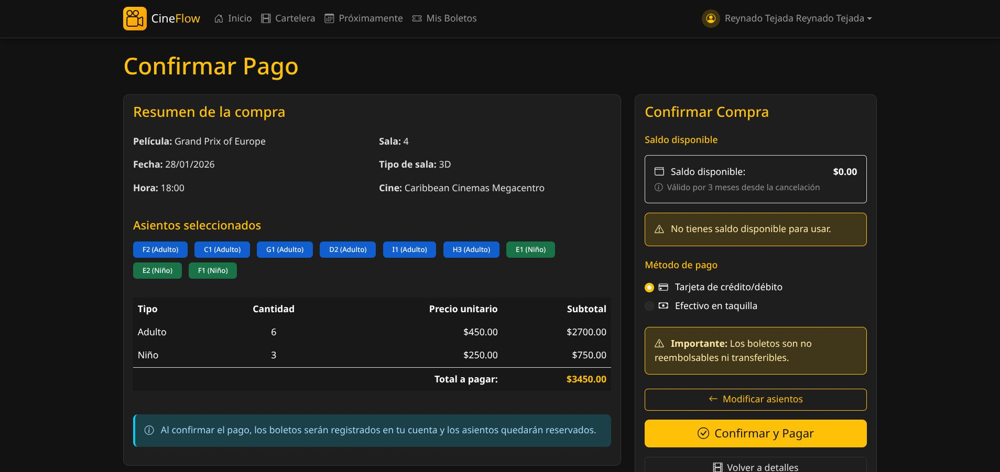  
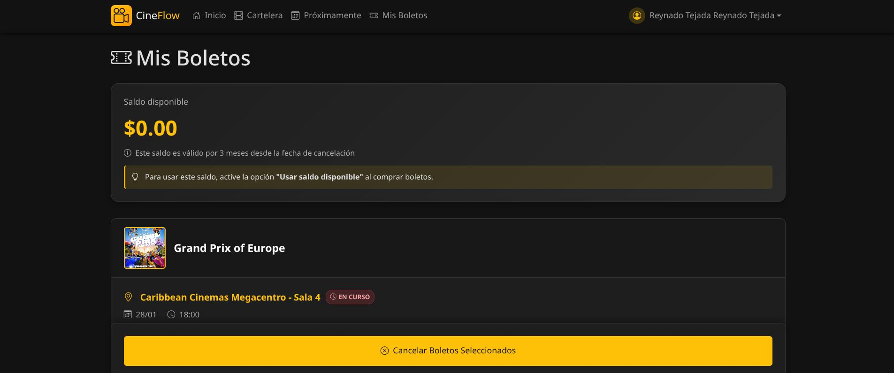  
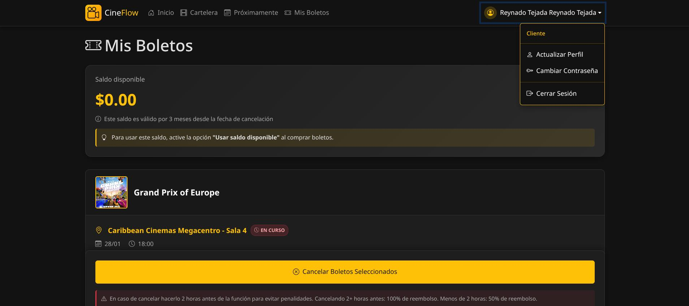

### 🛠️ Vista del Administrador
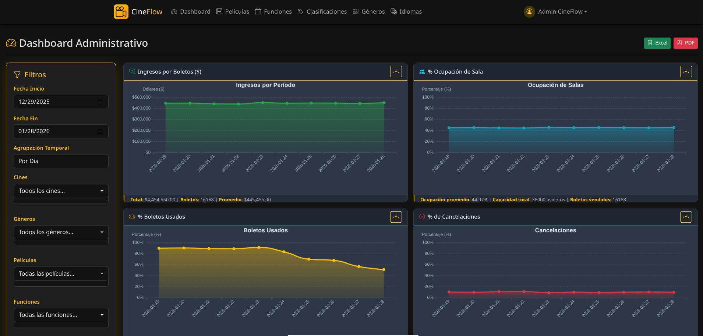  
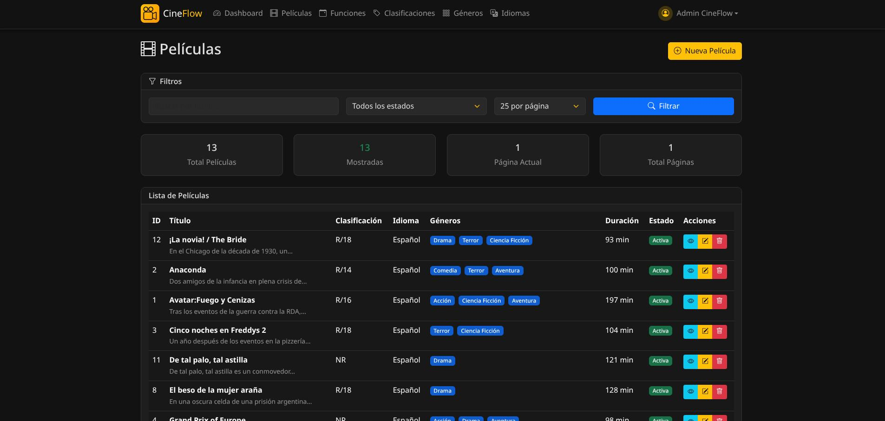  
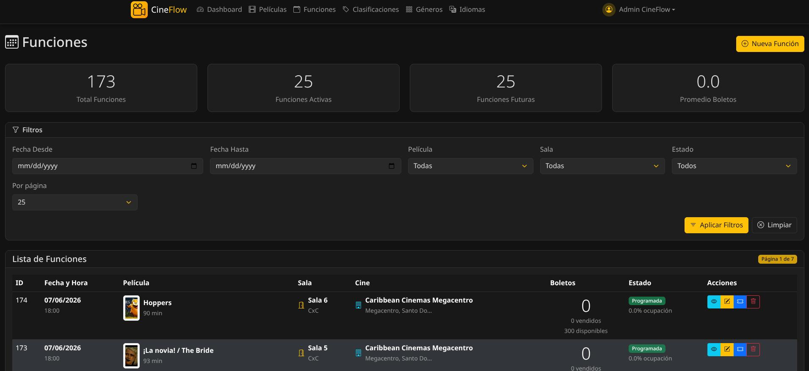  
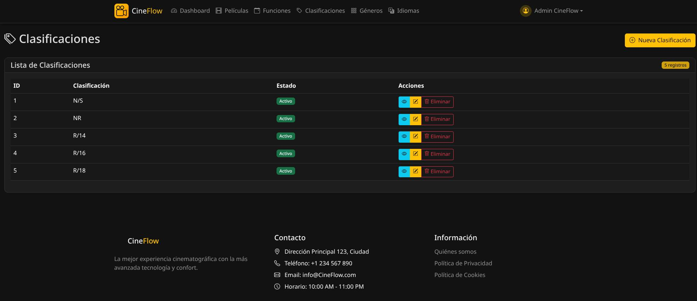  
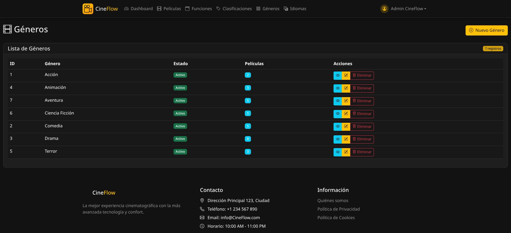  
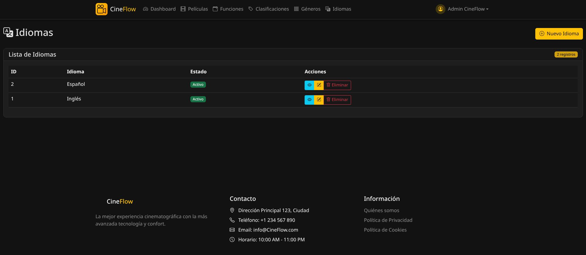

---

## ✅ Cumplimiento de Estándares

Este proyecto cumple con las buenas prácticas de desarrollo y está diseñado siguiendo estándares de calidad en:

- **Base de datos normalizada** (3FN)
- **Arquitectura MVC** clara y mantenible
- **Frontend responsive** con Bootstrap
- **CRUD completo** con validaciones
- **Reportes exportables** (Excel, PDF)
- **Entorno reproducible** con Docker + Nix
- **Documentación completa** y accesibilidad SSH
- **Manejo profesional de dependencias**

---

*Proyecto desarrollado para la administración eficiente de ventas de tickets de cine.*