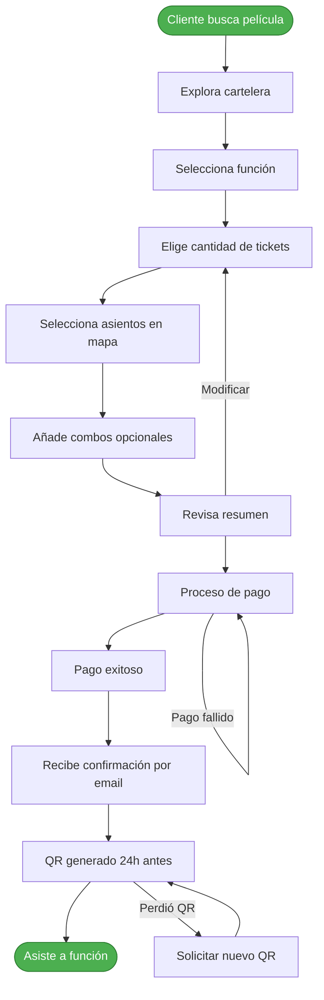

# Cine Flow

Sistema digital para administración de cines y venta de tickets.

## 👥 Roles de Usuario

### **Cliente**
- Usuario final que compra tickets para funciones
- Necesita consultar información y realizar compras

### **Administrador**
- Personal del cine que gestiona operaciones
- Requiere herramientas de gestión y reportes

## 🔄 Task Flows

### **Usuarios (Flujos Comunes)**
1. **Registrar cuenta** - Crear nuevo usuario
2. **Iniciar sesión** - Autenticación en el sistema
3. **Recuperar contraseña** - Restablecer credenciales
4. **Cerrar sesión** - Finalizar sesión activa
5. **Actualizar perfil** - Modificar información personal

### **Administrador**
1. **Gestionar películas**
   - Agregar nuevas películas
   - Actualizar información existente
   - Eliminar películas del catálogo
   
2. **Gestionar salas**
   - Crear/configurar nuevas salas
   - Definir capacidad y distribución
   - Mantenimiento de salas

3. **Programar funciones**
   - Vincular películas con salas
   - Establecer horarios y fechas
   - Modificar/cancelar funciones

4. **Reportes y métricas**
   - Ventas por período
   - Ocupación de salas
   - Popularidad de películas
   - Ingresos por combos

### **Cliente**
1. **Búsqueda y consulta**
   - Consultar horarios por película
   - Ver funciones por día
   - Explorar cartelera completa
   - Ver detalles de películas

2. **Proceso de compra**
   - Seleccionar función y horario
   - Elegir asientos disponibles
   - Agregar combos de comida
   - Completar pago seguro
   - Recibir confirmación

3. **Gestionar reservas**
   - Ver historial de compras
   - Modificar reservas existentes
   - Cancelar reservas (con políticas)
   - Recibir recordatorios

4. **Experiencia post-compra**
   - Recibir QR de acceso (24h antes)
   - Valorar experiencia
   - Obtener recomendaciones

## 📊 Task Flow (Ejemplo)

https://templatemo.com/tm-559-zay-shop

# Otras notas

* Para Registrar cuenta: ¿Qué campos como nombre, email, contraseña, etc.? ¿Hay campos adicionales como teléfono o fecha de nacimiento?

 
Nombre, Sexo, email, contraseña, Dirección, telefono, fecha de nacimiento
 

* Para Iniciar sesión: ¿Solo email y contraseña, o algo más?

Creo que email y contraseña. Tambien pueden acceder por cuenta de google
 

* Para Recuperar contraseña: ¿Proceso paso a paso, como email para enviar link, luego nueva contraseña?

Correcto, quiero un email con un codigo que sirva para por 2 horas para recuperar la contraseña
 

* Para Actualizar perfil: ¿Qué campos se pueden editar?

Pueden cambiar todo, desde el email, nombre y hasta el sexo
 

* Para Gestionar películas (agregar/actualizar): ¿Campos como título, descripción, duración, género, poster URL, etc.?

Titulo, descripcion carta, descripcion larga, varias etiquetas para el genero, image rectangular para poner en banner, imagen cuadrada para poner los catalogos de busqueda, un link al trailer, duracion de la pelicula
 

* Para Gestionar salas: ¿Campos como nombre de sala, capacidad, filas/columnas, tipo (2D/3D), etc.?

Nombre de sala, cantidad de filas, cantidad de asientos por cada fila, estado de la sala (activo/inactivo), tipo 2d/3d
 

* Para Programar funciones: ¿Campos como película ID, sala ID, fecha, hora, precio, etc.?
  película ID, sala ID, fecha en sala, hora de inicio, precio por dia de la semana (los domingos son mas caros, que los miercoles)

 

* Para Proceso de compra: En selección de asientos, combos, pago – ¿Campos de pago como tipo (tarjeta/crédito), detalles de tarjeta (número, expiry, CVV), dirección de facturación?
  selección de asientos, combos, pago (tarjeta/crédito), detalles de tarjeta (número, expiry, CVV), dirección de facturación

 

* Para Gestionar reservas: Para modificar/cancelar, ¿qué confirmaciones o campos?

las personas pueden cambiar de funcion siempre y cuando no hayan usado su QR para ingresar a la pelicula y no haya pasado una semana desde que se emitió el ticket, en en caso de reclamo el administrador puede hacer el cambio en el sistema sin importar esta regla. En caso de que haya diferencia de precio entre los tickets, los clientes pueden usar la diferencia en el maket de comida o pagar solo por la diferencia
 

* Para Valorar experiencia: ¿Campos como calificación (estrellas), comentario?

Quiero que califiquen con estrellas su experiencia con la pagina luego de cada compra y luego de asistir a la función puedan calificar la pelicula y su experiencia en el cine.
 
Creo que nos falta otro perfil de administrador que se encargue de confirmar sin el cliente asistió a la función y si tomó la comida que compró