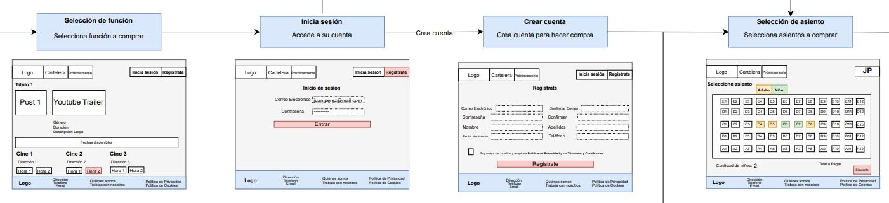

# Cine Flow

Sistema digital para administración de ventas de tickets para cines.

## Planificación

### Creación de User Flow



### Creaciónde Diagrama Entidad Relación


## Definición de entorno

### Virtual Enviroment

```bash
cat ./default.nix
let
  pkgs = import (fetchTarball "https://github.com/rstats-on-nix/nixpkgs/archive/2025-12-02.tar.gz") {};

  pyconf = builtins.attrValues {
    inherit (pkgs.python313Packages)
      pip
      ipykernel
      flask
      flask-login
      flask-bcrypt
      sqlalchemy
      pymssql
      pandas
      openpyxl;
  };

  system_packages = builtins.attrValues {
    inherit (pkgs)
      glibcLocales
      nix
      python313
      freetds;
  };

  shell = pkgs.mkShell {
    LOCALE_ARCHIVE = if pkgs.system == "x86_64-linux" then "${pkgs.glibcLocales}/lib/locale/locale-archive" else "";
    LANG = "en_US.UTF-8";
    LC_ALL = "en_US.UTF-8";
    LC_TIME = "en_US.UTF-8";
    LC_MONETARY = "en_US.UTF-8";
    LC_PAPER = "en_US.UTF-8";
    LC_MEASUREMENT = "en_US.UTF-8";
    buildInputs = [ pyconf system_packages ];
  };
in
  {
    inherit pkgs shell;
  }
```

### docker-compose

```bash
cat ./docker-compose.yml
services:
  # =======================================================
  # 1. SQL SERVER
  # =======================================================
  mssql2025:
    image: mcr.microsoft.com/mssql/server:2025-RC1-ubuntu-24.04
    container_name: mssql2025
    hostname: mssql2025
    environment:
      ACCEPT_EULA: "Y"
      MSSQL_SA_PASSWORD: "Pass123!"
    ports:
      - "1433:1433"
    networks:
      - dev-network
    volumes:
      - ./cineflow_setup.sql:/tmp/mssql-init.sql
    healthcheck:
      test: >
        /opt/mssql-tools18/bin/sqlcmd
        -S localhost
        -C
        -U sa
        -P Pass123!
        -Q "SELECT 1"
        -b -o /dev/null
      interval: 1s
      timeout: 30s
      retries: 30
      start_period: 20s

  # =======================================================
  # 2. INICIALIZACIÓN DE BASE DE DATOS
  # =======================================================
  mssql-init:
    image: mcr.microsoft.com/mssql-tools:latest
    container_name: mssql-init
    restart: "no"
    depends_on:
      mssql2025:
        condition: service_healthy
    networks:
      - dev-network
    volumes:
      - ./cineflow_setup.sql:/tmp/mssql-init.sql
    command: >
      /bin/sh -c "
        /opt/mssql-tools/bin/sqlcmd -S mssql2025 -U sa -P Pass123! -Q \"IF DB_ID('CineFlow') IS NULL CREATE DATABASE CineFlow\" &&
        until /opt/mssql-tools/bin/sqlcmd -S mssql2025 -U sa -P Pass123! -Q \"SELECT name FROM sys.databases WHERE name='CineFlow'\" | grep -q CineFlow;
        do echo 'Esperando que CineFlow esté disponible...'; sleep 2; done &&
        /opt/mssql-tools/bin/sqlcmd -S mssql2025 -U sa -P Pass123! -d CineFlow -i /tmp/mssql-init.sql
      "

  # =======================================================
  # 3. APLICACIÓN
  # =======================================================
  cineflow:
    build:
      context: .
    container_name: cineflow
    ports:
      - "2224:22"
      - "5000:5000"
    volumes:
      - .:/root/cineflow
    networks:
      - dev-network
    depends_on:
      - mssql-init

networks:
  dev-network:
    driver: bridge
```


### Dirtree

```bash
tree -L 2
.
├── app.py
├── cineflow_setup.sql
├── config.py
├── controllers
│   ├── boleto_controller.py
│   ├── dashboard_controller.py
│   ├── funcion_controller.py
│   ├── pelicula_controller.py
│   ├── __pycache__
│   └── usuario_controller.py
├── crear_usuarios_hash.py
├── crear_usuarios_hash.sql
├── database.py
├── default.nix
├── diagramas
│   ├── Entidad Relación - Cine Flow.drawio.pdf
│   ├── User Flow - Administrador.drawio.pdf
│   ├── User Flow - Cliente.drawio.pdf
│   └── User Flow - Encargado de Entrada.drawio.pdf
├── docker-compose.yml
├── Dockerfile
├── entrypoint.sh
├── img
│   ├── 01-trust-files
│   ├── 02-allow-dir-env.jpg
│   └── 03-install-dir-env.jpg
├── models.py
├── __pycache__
│   ├── config.cpython-313.pyc
│   ├── database.cpython-313.pyc
│   └── models.cpython-313.pyc
├── README.md
├── static
│   ├── css
│   └── js
└── templates
    ├── admin_dashboard.html
    ├── asiento
    ├── base.html
    ├── boleto
    ├── boleto_cancelado
    ├── boletos
    ├── boleto_usado
    ├── cine
    ├── clasificacion
    ├── funcion
    ├── funciones
    ├── genero
    ├── idioma
    ├── index.html
    ├── pelicula
    ├── pelicula_genero
    ├── peliculas
    ├── rol_usuario
    ├── sala
    ├── tipo_boleto
    ├── tipo_sala
    └── usuario
```

## Como correr la applicación

```bash
docker compose up -d --build
```

**localhost:5000**
